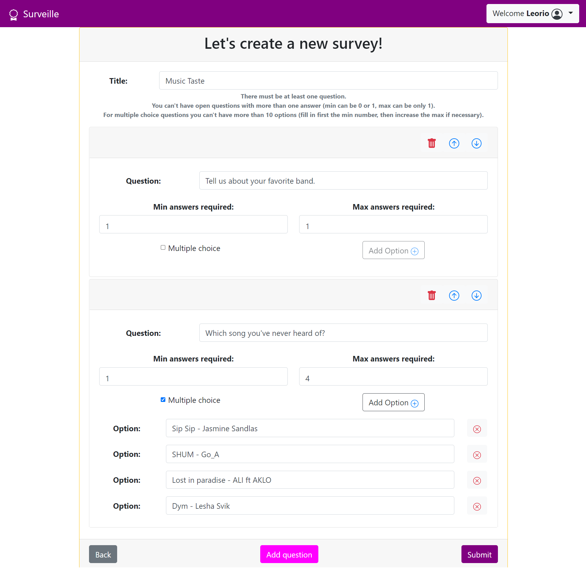

# Exam #1: "Questionario"
## Student: s290207 Comparetto Alessandra

## React Client Application Routes

- Route `/` : in this route the generic user can see every survey that he can answer to.
- Route `/survey/:id` : in this page the generic user can fill in the survey and submit their answers. If the user is logged in then they'll be able to check the submissions of generic users for that survey. The param in the route is the ID of the survey.
- Route `/survey` : here the logged user (the admin) can creare a new survey and pubish it.
- Route `/login` : in this page the admin user can log in.

----
----

## API Server

- POST `/api/sessions`
  - request parameters : none
  - request body : an object with the authetication fields
    ```json
    {
        "username": "kurapika@studenti.polito.it",
        "password": "Qwerty123"
    }
    ```
  - response body : an object bearing all the information of the user
    ```json
    {
      "email": "kurapika@studenti.polito.it",
      "name": "Kurapika"
    }
    ```
----
- GET `/api/sessions/current`
  - request parameters : none
  - request body : none
  - response body : A string, bearing the name of the admin
    ```
    Kurapika
    ```
----
- DELETE `/api/sessions/current`
  - request parameters : none
  - request body : none
  - response body : none 

  This API lets the admin log out.
----
- GET `/api/surveys`
  - request parameters: none
  - request body : none
  - response body content: an array of objects containing superficial data for every survey. 
    ```json
    [
      {
        "id": 1,
        "author": "Leorio",
        "title": "Sport interests",
        "num": 5
      },
      {...}
    ]
    ```
----
- GET `/api/survey/:id`
  - request parameters : `id` which represents the ID of the survey
  - request body : None
  - response body : an object bearing all the information of that survey (questions and options for each question)
    ```json
    {
      "title": "Anime",
      "questions": 
      [
        {
          "id": 10,
          "text": "When did you start watching anime?",
          "open": 1,
          "min": 1,
          "max": 1
        },
        {
          "id": 11,
          "text": "Who's your favorite among these?",
          "open": 0,
          "min": 1,
          "max": 1,
          "options": 
          [
            {
              "id": 18,
              "text": "Tanjiro"
            },
            {...}
          ]
        }, 
        {...}
      ]
    }
    ```
----
- GET `/api/adminsurveys`
  - request parameters : none
  - request body : node
  - response body content : an array of objects containing superficial data for every survey of the logged user
    ```json
    [
      {
        "id": 2,
        "title": "Pets and Animals",
        "num": 2
      },
      {...}
    ]
    ```
----
- GET `/api/adminsurveys/:id/answers`
  - request parameters : `id` which represents the ID of the survey
  - request body : none
  - response body : an array of objects each of them bearing a different submission.
    ```json
      [
        {
          "id_submission": 3,
          "user": "Spike",
          "values": [
            {
              "id_question": 6,
              "value": "Ein"
            },
            {
              "id_question": 7,
              "value": "Less than 3"
            },
            {
              "id_question": 8,
              "value": "No"
            },
            {
              "id_question": 9,
              "value": "No. I hate them."
            }
          ]
        },
        {...}
      ]
      ```
----
- POST `/api/submission`
  - request parameters : none
  - request body : an object bearing the ID of the survey, the name of the user and the answers given by the user.
    ```json
    {
      "survey":"1",
      "user":"Gabriel",
      "answers":[
          {"id_question":1,"value":"20"},
          {"id_question":3,"value":"Michael Jordan"},
          {"id_question":5,"value":"Futsal"},
          {"id_question":5,"value":"Cricket"}
          ]
      }
    ```
  - response body content : an object with the id of the submission just added.
    ```json
    {"addedSubmission": 40}
    ```
----
- POST `/api/survey`
  - request parameters : none
  - request body : an object bearing the title of the survey and an array with all the question that the survey has.
     ```json
    {
      "title":"Anime",
      "questions":
        [
          {
            "question":"Why do you like anime?",
            "min":1,
            "max":1,
            "open":1,
            "options":[""]
          },
          {
            "question":"Check the ones you've watched",
            "min":1,
            "max":8,
            "open":0,
            "options":
              [
                "The Promised Neverland",
                "Attack on Titan",
                "Cowboy Bebop",
                "My Hero Academia",
                " Ergo Proxy"
              ]
          },
          {...}
        ]
    }
    ```
  - response body content : an object with the id of the survey just added.
    ```json
    {"addedSurvey": 4}
    ```
----
----

## Database Tables

- Table `admin` - contains id, name, email, hash (of the password). Its goal is to record all the useful information about admins.
- Table `survey` - contains id, title, id_admin (references admin.id). Links the survey to its creator.
- Table `question` - contains id, id_survey (references survey.id), text (the question itself), open, min, max. Records for each question the survey that contains it and its options.
- Table `option` - contains id, id_question (references question.id), text (the option itself). Links a multiple choice question to its options.
- Table `submission` - contains id, id_survey (references survey.id), user (the name of the user). Records the submissions sent.
- Table `answer` - contains id, id_survey (references survey.id), id_question (references question.id), id_submission (references submission.id), value (the value of the answer, so either a text of max 200 characters or the value of the selected option). Records every answer given.
----
---
## Main React Components
Main components

- `LoginForm` (in `Components/LoginForm/LoginForm.js`): this is used to let the admin log in.
- `SurveyCreationForm` (in `Components/SurveyCreationForm/SurveyCreationForm.js`): this component is used to create the structure of a new survey. It manages a big status object called `questions`
- `QuestionCard` (in `Components/SurveyCreationForm/QuestionCard.js`): this component is the child of `SurveyCreationForm`. It lets the admin focus on a specific question while making it. 
- `Homepage` (in `Components/Homepage.js`): this is the page from which the user can chose which survey to answer to. The admin user, instead, can look at the aswers that their surveys received and create new ones.
- `SurveyForm` (in `Components/SurveyForm.js`): with this component the user is able to answer to a survey and save their answers. Instead, the admin is able to check every submission that was sent to that survey. 
- `SurveysPreview` (in `Components/SurveysPreview.js`): contains the list of the surveys. Shows for each survey the superficial information: the user will be able to see title, author and number of questions; the admin will be able to the title and the number of submissions.

Minor components
- `MyNav` (in `Components/MyNav/MyNav.js`)
- `ErrorAlert` (in `Components/ErrorAlert.js`)
(only _main_ components, minor ones may be skipped)

----
----
## Screenshot



----
----
## Users Credentials

- username: `Leorio`, email : `leorio@studenti.polito.it`, password : `Qwerty123`
  - This admin has created the survey `Sport interests` (id: `1`)
- username: `Kurapika`, email : `kurapika@studenti.polito.it`, password: `Qwerty123`
  - This admin has created the surveys `Pets and Animals` (id: `2`) and `Anime` (id: `3`)

